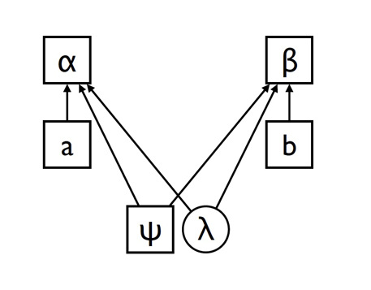

# ⚒ Entanglement

## Content

* Bell theorem and the EPR paradox
* quantum correlations and inequalities, CHSH
* Peres-Mermin magic square
* GHZ paradox
* how to identify entanglement

## EPR Paradox

written by Einstein, Podolsky and Rosen (1935).\
first they define something called "element of reality" - a trait that we can know with certainty without interfering the system in any way - and now we ask ourself is quantum theory a whole? meaning, is it giving a consistent explenation to all of reality's elements.

the writers discussed continues variables like position and momentum, but we're going to talk about discrete variables.

lets give Alice and Bob to share a quantum state $$\ket{\psi^-}=\frac{\ket{01}-\ket{10}}{\sqrt2}$$, if both of them are measuring their qubits in the computational basis, the eigen vectors of the Z-Paulli $$\ket0,\ket1$$, then it's easy to see they are going to get the opposite results.\
this statement is generally true:

**argument:** consider the state $$\ket{\psi^-}$$ so for every direction choice $$\hat{v}$$ that Alice will choose to measure the qbuit at, i.e $$\vec{\sigma} \cdot \hat{v}$$, Bob will get the opposite result. \
\
**proof:** we can write the eigen vectors of $$\vec{\sigma} \cdot \hat{v}$$ with $$\ket{a},\ket{b}$$ and get

$$
\ket0=\alpha\ket{a}+\beta\ket{b}\newline \ket1=\gamma\ket{a}+\delta\ket{b} \newline
\frac{\ket{01}-\ket{10}}{\sqrt2} \rarr (\alpha\gamma-\beta\delta) \rarr \frac{\ket{ab}-\ket{ba}}{\sqrt2}
$$

for evevry direction Alice will measure her qubit she can infer by the result Bob's result on the same direction of measurement (the opposite of Alice's result) - even if Bob and Alice are far away from each other. meaning that Bob's result is "elements of reality" because Alice knows it without interfere with Bob.

now EPR arguing that those elements cannot be described by quantum theory. since if Alice measures in $$\hat{z}$$ and Bob in $$\hat{x}$$ then we can know at the same time the spin in both directions, and this contradicts the uncerteinty principle. thus the researches conclude that the theory is not a whole since we have a clash between quantum theory to relativity theory (2 far points can not affect each other faster then the speed of light).

what stands behind EPR's wanted description for the phenomena is a group of so called hidden variables $$\{\lambda\}$$, that are not exposed to us and the quantum theory does not describe them, but they were defined and they are responsible for the corellation between the results of entangled states.

&#x20;

<figure><figcaption>
hidden variables illustration
</figcaption></figure>

today we believe that EPR were wrong in this classical-local description, and we believe that the quantum theory is non-local in its nature but still can't allow communication faster then the speed of light. the hidden variables description that EPR wanted is not consistent with quantum theory, but there's still no contradiction with relativity principle.

## Bell's Experiment

Bell tried to give a mathematical expression for Einstein's expectation. the expectation, as we said, was that entangled states $$\ket{\psi^-}$$ can be explained by hidden variables. those hidden variables will hold predefined values, according to each decision of Alice and Bob without the result of either one of them to affect the result of the other.

To obtain Bell’s inequality, we’re going to do a thought experiment, which we will analyze using our common sense notions of how the world works. After we have done the common sense analysis, we will perform a quantum mechanical analysis which we can show is not consistent with the common sense analysis.

Imagine we perform the following experiment:

1. Charlie prepares two particles. It doesn’t matter how he prepares the particles, just that he is capable of repeating the experimental procedure which he uses.
2. Once he has performed the preparation, he sends one particle to Alice, and the second particle to Bob.
3. Once Alice receives her particle, she performs a measurement on it. Imagine that she has available two different measurement apparatuses, so she could choose to do one of two different measurements.\
   These measurements are of physical properties which we shall label PQ and PR, respectively. Alice doesn’t know in advance which measurement she will choose to perform. Rather, when she receives the particle she flips a coin or uses some other random method to decide which measurement to perform. We suppose for simplicity that the measurements can each have one of two outcomes, +1 or −1.\
   Suppose Alice’s particle has a value Q for the property $$P_Q$$. Q is assumed to be an objective property of Alice’s particle, which is merely revealed by the measurement, Similarly, let R denote the value revealed by a measurement of the property $$P_R$$.
4. Similarly, suppose that Bob is capable of measuring one of two properties, $$P_S$$ or $$P_T$$, once again revealing an objectively existing value S or T for the property, each taking value +1 or −1. Bob does not decide beforehand which property he will measure, but waits until he has received the particle and then chooses randomly.

The timing of the experiment is arranged so that Alice and Bob do their measurements at the same time, Therefore, the measurement which Alice performs cannot disturb the result of Bob’s measurement (or vice versa), since physical influences cannot propagate faster than light.

<figure><figcaption>
Bell's experiment illustration
</figcaption></figure>

It's time for some algebra:

$$
QS+RS+RT-QT=S\left( Q + R \right) + T\left( R - Q \right)
$$

Because $$R,Q=\pm1$$ it follows that either $$S(Q+R)=0\space or \space T(R-Q)=0$$. in either case e, it is easy to see that $$QS+RS+RT-QT=\pm2$$.\
Suppose next that $$p(q, r, s, t)$$ is the probability that, before the measurements are performed, the system is in a state where $$Q=q,R=r,S=s,T=t$$ as you remember we're looking at the system as a "hidden variables" that were given before the measurement. These probabilities may depend on how Charlie performs his preparation, Letting $$E(·)$$ denote the mean value of a quantity, we have:

$$
E(QS+RS+RT-QT)=\sum_{qrst}p(q,r,s,t)\newline \times (qs+rs+rt-qt)\le\sum_{qrst}p(q,r,s,t)\times2=2
$$

Also,

$$
E(QS + RS + RT − QT)=\sum_{qrst}p(q,r,s,t)qs+\newline \sum_{qrst}p(q,r,s,t)rs + \sum_{qrst}p(q,r,s,t)rt - \sum_{qrst}p(q,r,s,t)qt \newline =E(QS) + E(RS) + E(RT) − E(QT)
$$

using above results we obtain _Bell's inequality_

$$
E(QS) + E(RS) + E(RT) − E(QT)\le2
$$

By repeating the experiment many times, Alice and Bob can determine each quantity on the left hand side of the Bell inequality.\
After finishing a set of experiments, Alice and Bob get together to analyze their data. They look at all the experiments where Alice measured $$P_Q$$ and Bob measured $$P_S$$. By multiplying the results of their experiments together, they get a sample of values for $$QS$$. By averaging over this sample, they can estimate $$E(QS)$$ to an accuracy only limited by the number of experiments which they perform.

Now let's show that quantum mechanics allows $$B_{CHSH}\gt2$$, Assuming Charlie prepares a quantum system of two qubits in the state

$$
\ket\psi = \frac{\ket{01}-\ket{10}}{\sqrt2}
$$

He passes the first qubit to Alice, and the second qubit to Bob. They perform measurements of the following observables:

$$
Q=Z_1,\space S=\frac{-Z_2-X_2}{\sqrt2}\newline
R=X_1,\space T=\frac{Z_2+X_2}{\sqrt2}
$$

Simple calculations show that the average values for these observables, written in the quantum mechanical $$\langle \space·\rangle$$ notation, are:

$$
\langle QS \rangle = \frac{1}{\sqrt2};\langle RS \rangle = \frac{1}{\sqrt2};\langle RT \rangle = \frac{1}{\sqrt2};\langle QS \rangle = -\frac{1}{\sqrt2}
\newline
4\gt\langle B_{CHSH}\rangle = 2\sqrt2\gt2
$$

**The assumptions made in Bell's Experiment**

1. The assumption that the physical properties $$PQ, PR, PS, PT$$ have definite values $$Q, R, S, T$$ which exist independent of observation. This is sometimes known as the assumption of _realism_.&#x20;
2. The assumption that Alice performing her measurement does not influence the result of Bob’s measurement. This is sometimes known as the assumption of _locality._

These two assumptions together are known as the assumptions of _local realism_.\
What can we learn from Bell’s inequality? The world is **not** locally realistic.

## Peres-Mermin's Magic Square

TODO

## GHZ Paradox

TODO

## Ways to Identify Entanglement

Now we'll show a few ways to identify if a given quantum state is an entangled state

#### Inseparable state

TODO

#### Bell's inequality

TODO

#### Peres–Horodecki Criteria

TODO

#### Entanglement Entropy

TODO
